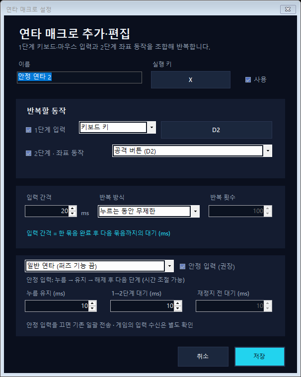

# RapidPoint

Windows에서 원하는 창을 지정하고, 키보드 키를 좌표 클릭이나 반복 입력에 연결하는 데스크톱 도구입니다.

**[최신 Windows 버전 다운로드](https://github.com/leemjnc/RapidPoint/releases/latest/download/RapidPoint-Windows-x64.zip)** · **[사용설명서](USER_GUIDE.md)** · **[릴리스 목록](https://github.com/leemjnc/RapidPoint/releases)**

## 다운로드하고 실행하기

1. 위 **최신 Windows 버전 다운로드**를 누릅니다.
2. ZIP을 원하는 폴더에 압축 해제합니다.
3. `RapidPoint.exe`를 실행합니다. 설치 과정이나 별도의 .NET 설치는 필요하지 않습니다.
4. **창 목록에서 선택**으로 사용할 창을 지정합니다.

지원 환경: Windows 10/11 **x64**. macOS·Linux용 프로그램은 아닙니다.

GitHub의 **Code → Download ZIP**이나 릴리스의 **Source code**는 프로그램 다운로드가 아닙니다. 릴리스 **Assets**의 `RapidPoint-Windows-x64.zip`을 받으세요.

## 주요 기능

- 키 하나를 특정 좌표의 마우스 이동·클릭에 연결
- 대상 창이 전면에 있을 때만 입력 활성화
- 창 내부 좌표 저장 및 창 이동·크기에 따른 비율 보정
- 키를 누를 때 클릭, 누르는 동안 버튼 유지, 키를 놓을 때 클릭
- 키보드·마우스 입력을 조합하는 여러 연타 매크로
- 누르는 동안 반복, 토글 반복, 지정 횟수 실행
- 누름 유지시간과 단계 간 대기를 설정하는 **안정 입력**
- `ESC+지정 키 → 클릭 → 선택적으로 ESC` 퍼즈 스킬
- `클릭 → ESC`, `ESC → 클릭` 퍼즈 반복과 `ESC+지정 키` 동시 입력

## 가장 간단한 시작

**좌표 바인딩:** `+ 새 바인딩` → 할당 키 선택 → `좌표 입력` → 대상 창의 원하는 위치 클릭 → 저장.

**연타:** `+ 새 매크로` → 실행 키 선택 → 1단계 키와 2단계 좌표 선택 → `누르는 동안 무제한` → 저장.

처음에는 **지정 횟수 1회**로 동작과 위치를 확인하세요. 더 빠른 반복을 원해도 유지시간을 무작정 줄이지 않는 것이 좋습니다.

## 중지 방법

- 누르는 동안 반복: 실행 키를 놓으면 현재 입력 묶음을 마친 뒤 중지합니다.
- 토글 반복: 같은 실행 키를 다시 누르면 현재 묶음을 마친 뒤 중지합니다.
- 다른 창으로 전환하거나 RapidPoint를 종료하면 안전 취소와 입력 해제를 시도합니다.
- 현재 버전에는 별도의 전역 긴급 정지 단축키가 없습니다.

## 알아두세요

- Windows `SendInput`을 통한 **소프트웨어 입력**입니다. 실제 하드웨어 입력과 동일하거나 게임에서 허용된다고 보장하지 않습니다.
- 대상 프로그램의 메모리 수정, DLL 주입, 게임 파일 수정, 게임 통신 조작 기능은 없습니다.
- 게임의 코스트·카드·일시정지 상태나 스킬 성공 여부를 판독하지 않습니다. 입력 누락 없음, 특정 프레임 기록, 0.033초 결과를 보장하지 않습니다.
- 각 프로그램·게임의 이용 정책을 확인하고 허용된 환경에서만 사용하세요. CORSAIR, MuMu, BlueStacks 또는 게임사의 공식 제품이 아닙니다.
- 배포 파일은 현재 코드 서명되지 않았습니다. 보안 경고가 표시되면 출처와 해시를 확인하세요. 보안 기능을 끄도록 안내하지 않습니다.
- 개인 설정은 `%LOCALAPPDATA%\RapidPoint\settings.json`에 저장됩니다. 자동 업데이트는 없으며, 프로그램을 종료한 뒤 새 파일로 교체합니다.

오류 제보는 [Issues](https://github.com/leemjnc/RapidPoint/issues)에 버전·재현 순서·사용 모드·간격을 적어주세요. 개인 정보가 담긴 설정 파일이나 전체 화면은 그대로 올리지 마세요.

## 소스 코드와 라이선스

소스와 문서는 [MIT 라이선스](LICENSE)로 공개합니다. 개발 환경과 빌드·테스트 방법은 [빌드 안내](BUILD.md)를 참고하세요. .NET 런타임의 별도 라이선스·제3자 고지도 함께 제공합니다.
