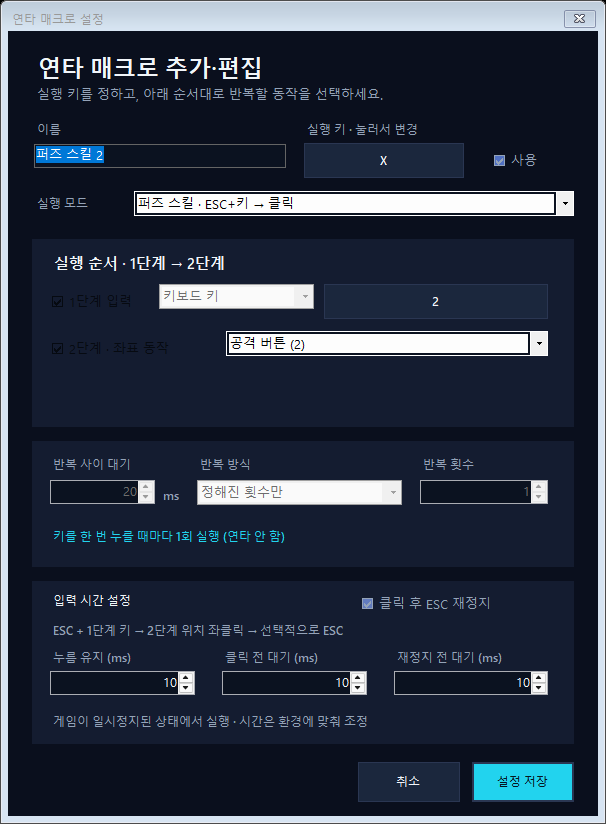

# RapidPoint 사용설명서

기준 버전: **1.11.5** · [다운로드](https://github.com/leemjnc/RapidPoint/releases/latest/download/RapidPoint-Windows-x64.zip) · [처음으로](README.md)

## 1. 실행과 대상 창 지정

ZIP 압축을 풀고 `RapidPoint.exe`를 실행합니다. 별도의 설치나 .NET 설치는 필요 없습니다.

1. 사용할 프로그램을 먼저 실행합니다.
2. RapidPoint에서 **창 목록에서 선택**을 누릅니다.
3. 목록에서 실행 파일 이름과 창 제목을 확인해 원하는 창을 선택합니다. 목록이 오래되었으면 새로 고침합니다.
4. 그 창으로 돌아가면 키 바인딩과 매크로 입력이 활성화됩니다. 다른 창에서는 새 입력을 실행하지 않습니다.

특정 에뮬레이터에 종속되지 않습니다. 다만 프로그램의 권한·입력 처리 방식에 따라 동작하지 않을 수 있습니다. RapidPoint만 여러 개 실행하지 마세요.

## 2. 특정 좌표에 키 연결하기

1. **+ 새 바인딩**을 누릅니다.
2. 이름과 할당 키를 정합니다. 이미 다른 바인딩·매크로에서 사용하는 실행 키는 피합니다.
3. 마우스 이동 또는 클릭 동작과 클릭 버튼을 선택합니다.
4. **좌표 입력**을 누르면 대상 창에 좌표 선택 화면이 표시됩니다.
5. 원하는 위치를 한 번 클릭합니다. 선택 클릭은 좌표를 정하기 위한 것입니다.
6. 원래 바인딩 설정창으로 돌아오면 X/Y를 확인하거나 직접 수정하고 **저장**합니다.

좌표 선택에는 시간 제한이 없습니다. 선택을 취소하려면 ESC를 누릅니다.

### 좌표 방식의 차이

| 방식 | 동작 |
| --- | --- |
| 화면 좌표 | 화면상의 절대 X/Y. 대상 창을 옮기면 의도한 지점과 달라질 수 있습니다. |
| 창 내부 비례 좌표 | 저장 당시 창 내부 크기를 기준으로 현재 창 위치·크기에 맞게 보정합니다. |
| 현재 위치 | 커서를 지정 좌표로 옮기지 않고 현재 위치에서 동작합니다. |

창 크기 보정은 가로·세로 비율 계산입니다. 게임 UI 배치가 달라지거나 검은 여백·화면 비율이 바뀌면 같은 버튼을 보장하지 않으므로 다시 확인하세요.

### 키를 언제 클릭으로 바꿀지

| 실행 방식 | 키를 누를 때 | 키를 놓을 때 |
| --- | --- | --- |
| 한 번 실행 | 지정한 동작 실행 | 추가 동작 없음 |
| 누르는 동안 누름 유지 | 좌표 이동 후 마우스 버튼 누름 | 버튼 해제 |
| 키를 놓을 때 클릭 | 지정 좌표로 이동 | 지정 좌표로 다시 이동한 뒤 클릭 |

**키를 놓을 때 클릭**은 누르는 동안 커서를 다른 곳으로 옮겼더라도 놓는 순간 저장한 좌표로 돌아갑니다. 단, **현재 위치** 모드는 돌아갈 좌표가 없으므로 놓는 순간의 커서 위치를 클릭합니다.

누름 유지는 마우스 버튼을 유지하는 기능입니다. 사용자의 물리적 마우스 이동을 차단하거나 커서를 고정하는 기능은 아닙니다.

## 3. 일반 연타 매크로

1. **+ 새 매크로**에서 이름과 실행 키를 지정합니다.
2. **1단계 입력**에서 키보드 키 또는 마우스 클릭을 선택합니다.
3. **2단계 · 좌표 동작**에서 현재 마우스 위치 또는 저장한 바인딩을 고릅니다.
4. 필요한 단계만 켜고, 반복 방식과 간격을 정합니다.
5. 하단 모드를 **일반 연타**로 두고 **안정 입력 (권장)**을 켭니다.
6. 처음에는 **지정 횟수 1회**로 확인한 뒤 원하는 반복 방식으로 바꿉니다.

예: 실행 키 X, 1단계 키 2, 2단계 현재 위치를 지정하면 X를 누르는 동안 `키 2 → 현재 위치 클릭`을 반복할 수 있습니다.

마우스 1단계 다음에는 저장된 좌표 동작만 사용할 수 있습니다. `현재 위치 마우스 클릭 → 현재 위치 마우스 클릭` 조합은 지원하지 않습니다.

### 1단계 키의 좌표 바인딩 적용

**1단계 키 바인딩 적용**을 켜고 해당 키에 활성 바인딩이 있으면, 키를 재전송하는 대신 바인딩 동작을 직접 실행한 뒤 2단계를 실행합니다. 예: Q가 카드 좌표라면 `Q의 카드 좌표 클릭 → 2단계 클릭`입니다. 2단계가 현재 위치이면 1단계 이동 전 커서 위치를 사용하며 매 반복 새로 기억합니다.

실제 Q 키 자체를 게임에 보내려면 이 옵션을 끄세요. 일치하는 활성 바인딩이 없으면 실제 키를 보냅니다. 퍼즈 모드에서는 항상 실제 스킬 키를 사용합니다.

### 마우스 클릭 후 원래 위치로 복귀

1단계가 마우스 클릭이고 2단계가 켜져 있으면 `원래 위치 A에서 클릭 → 저장 좌표 B의 설정된 동작 → A로 복귀`를 반복합니다. 바인딩이 이동이면 이동만, 클릭이면 클릭까지 실행합니다. 복귀 자체는 추가 클릭을 보내지 않습니다.

각 반복 시작 시 A를 기억하므로 반복 사이에 직접 마우스를 움직이면 새 위치가 다음 A가 됩니다. 누르는 동안 반복에서 키를 놓으면 현재 묶음의 복귀까지 마칩니다. 다른 창으로 전환하거나 종료하면 안전 취소가 우선이며 추가 복귀 이동은 하지 않습니다.

이 조합에는 **클릭 보호 적용**이 자동으로 켜집니다. 각 누름 유지와 단계 대기는 최소 20ms이며 더 긴 설정값은 유지합니다. B 동작 후 복귀 전에도 단계 대기만큼 기다립니다. 이는 게임 입력 수신을 보장하지 않으며 환경에 따라 유지·대기를 더 늘려야 할 수 있습니다.

### 안정 입력과 시간 설정

안정 입력에서는 다음 순서를 지킵니다.

`1단계 누름 → 유지 → 해제 → 단계 대기 → 2단계 위치 이동/클릭 → 다음 반복 대기`

- **누름 유지:** 각 키·마우스 버튼을 눌러 두는 시간입니다. 기본값은 10ms입니다.
- **1→2단계 대기:** 1단계 해제 후 2단계 전에 기다리는 시간입니다. 기본값은 10ms입니다.
- **입력 간격:** 한 묶음을 완료한 뒤 다음 묶음까지 기다리는 시간입니다. 기본값은 20ms입니다.

키와 클릭을 모두 쓰는 기본 설정은 유지 10 + 단계 대기 10 + 클릭 유지 10 + 반복 대기 20 = **명목상 50ms/주기**입니다. 실제로는 OS 처리시간과 다른 실행 작업이 더해집니다. 20ms를 입력했다고 전체 주기가 20ms가 되는 것은 아닙니다.

안정 입력을 끄면 실제 키 입력은 기존의 즉각적인 누름·해제 일괄 전송을 사용합니다. 1단계 바인딩을 적용하면 바인딩 동작 후 2단계를 순차 전송합니다. 단, **마우스 클릭 → 저장 좌표 동작**은 클릭 보호를 적용하므로 즉각 일괄 전송으로 바뀌지 않습니다. 더 빠르더라도 게임이 모든 입력을 처리한다는 뜻은 아닙니다. 입력이 누락되면 유지·대기 시간을 늘려 확인하세요.

### 반복 방식과 동시 실행

- **누르는 동안 무제한:** 키를 놓으면 현재 묶음을 완료하고 멈춥니다.
- **토글로 무제한:** 같은 키를 다시 누르면 현재 묶음을 완료하고 멈춥니다.
- **지정 횟수:** 설정 횟수만큼 묶음을 실행합니다. 실행 도중 같은 키를 다시 누르면 중지를 요청합니다.

일반 연타를 여러 개 만들 수 있지만 입력 묶음은 한 번에 하나씩 처리합니다. 동시에 실행하면 각 매크로의 속도가 느려질 수 있습니다. 매크로 실행 중에는 별도 바인딩이 실행되지 않으며, 누름 유지 바인딩을 먼저 놓아야 매크로를 시작할 수 있습니다.

### 게임 위 좌표·안내선·최근 클릭 보기

메인 화면 키 바인딩 아래의 **게임 위 좌표 보기**를 켜고 대상 창으로 돌아가세요.

- **왼쪽 위 하늘색 제목:** 현재 창 내부 X/Y와 현재 창 크기. 제목 표시줄·테두리는 제외하며 좌표 입력으로 새로 지정할 때와 같은 기준입니다.
- **왼쪽 위 노란색 제목:** 메인 목록에서 선택한 바인딩의 설정 입력용 X/Y와 저장 기준 크기. 기존 바인딩의 기준 크기를 유지하고 좌표만 수정하려면 이 값을 사용하세요.
- 예: 1920×1080 창의 (600,465)는 저장 기준이 1419×798이면 (443,344)입니다. X/Y는 키 이름이 아니라 가로/세로 좌표입니다. 이 값은 저장된 클릭 위치가 아니라 현재 포인터의 환산값입니다.
- **하늘색 가로·세로선:** 커서 중심에서 교차하는 테두리 없는 1픽셀 안내선입니다.
- **빨간 원·십자:** 감지한 클릭 위치를 약 0.8초 동안, 최근 8개까지 표시합니다. 물리적 클릭과 매크로 클릭을 함께 표시합니다.
- **왼쪽 아래 최근 클릭:** 마지막 클릭 한 건의 창 내부 좌표와 클릭 당시 창 크기를 다음 클릭 전까지 유지합니다. 이후 마우스를 움직이거나 창 크기를 바꿔도 숫자는 바뀌지 않습니다.

표시의 배경은 투명하며 게임 화면을 어둡게 하지 않습니다. 글자·선 위에서도 클릭은 게임으로 통과하고 게임 포커스를 가져오지 않습니다. 좌표를 보여 줄 뿐 저장하거나 게임의 스킬 성공 여부를 판독하지 않습니다. 빨간 표시는 Windows 클릭 이벤트 감지를 뜻하며 게임이 입력을 처리했다는 보장은 아닙니다.

다른 창이나 설정창으로 전환하면 숨겨집니다. 최근 클릭 좌표는 같은 대상 창으로 돌아오면 다시 보이고, 좌표 보기 옵션을 끄거나 대상을 바꾸면 지워집니다. 클릭 기록을 파일에 저장하지 않습니다. 독점 전체 화면에서 보이지 않는 경우 창 모드 또는 테두리 없는 창 모드를 사용하세요.

## 4. 퍼즈 스킬

하단에서 **퍼즈 스킬 · ESC+키 → 클릭**을 선택합니다.

1. 실행 키를 정합니다. 예: X.
2. 1단계에 실제 게임의 스킬 키를 지정합니다. 예: 2.
3. 2단계에 스킬을 겨냥할 좌표 또는 현재 마우스 위치를 선택합니다.
4. 실행 후 다시 멈추려면 **클릭 후 ESC 재정지**를 켭니다.
5. 게임이 일시정지된 상태에서 실행 키를 한 번 누릅니다.

실행 순서: **ESC+스킬 키 동시 누름 → 두 키 해제 → 좌클릭 → 선택적으로 ESC**.

이 모드는 한 번 누를 때 한 번 실행하며, 키를 빨리 놓아도 시작한 시퀀스를 계속합니다. 현재 위치를 선택하면 실행 시작 때 잡은 커서 위치를 사용합니다. 창 내부 좌표를 선택하면 클릭 시점의 창 위치·크기로 보정합니다.

누름 유지, 클릭 전 대기, 재정지 전 대기를 각각 설정합니다. 기존 값을 유지한 채 시작하고, 실제 게임에서 확인하며 조정하세요. 다른 매크로와 겹쳐 실행하거나 이전 퍼즈 입력이 끝나기 전에 새 입력을 예약하는 기능은 없습니다.

## 5. 퍼즈 반복과 ESC 동시 입력

| 모드 | 한 묶음 | 시작 전 확인 |
| --- | --- | --- |
| 퍼즈 반복 · 클릭 → ESC | 복귀 버튼 클릭 → ESC | 게임이 일시정지 상태인지 확인 |
| 퍼즈 반복 · ESC → 클릭 | ESC → 복귀 버튼 클릭 | 게임이 진행 중인지 확인 |
| ESC+지정 키 · 동시 입력만 | ESC와 1단계 키를 함께 누르고 해제 | 지정 키가 게임의 AUTO 등 원하는 키인지 확인 |

퍼즈 반복의 좌표는 **퍼즈 메뉴의 복귀 버튼**입니다. 스킬을 겨냥하는 좌표와 다릅니다. 반복 방식은 일반 연타처럼 설정합니다. 현재 위치를 선택하면 시작 때의 위치를 계속 사용합니다.

ESC 동시 입력만 모드는 클릭하지 않고 한 번 실행합니다. 프로그램이 게임의 실제 일시정지/AUTO 상태를 확인하지는 않습니다.

## 6. 안전 중지와 입력 실패

일반 중지 요청은 현재 묶음을 마친 뒤 처리하지만, **다른 창으로 전환하거나 프로그램을 종료하면 안전 취소가 우선**합니다. 이때 누른 키·버튼의 해제를 시도합니다. 중간 취소 후에는 게임의 일시정지 상태를 직접 확인하세요.

Windows가 입력 일부만 받아들인 경우에도 해제를 시도하고 반복을 중지하며 오류를 표시합니다. 같은 스킬이 두 번 발동할 수 있어 실패한 누름을 무조건 재전송하지 않습니다. OS가 해제 입력도 거부하면 프로그램만으로 해제를 보장할 수 없습니다.

현재 버전에는 별도 전역 긴급 정지 키가 없습니다. 문제가 생기면 다른 창으로 전환하고 RapidPoint를 종료하세요.

## 7. 업데이트·설정 백업

1. RapidPoint를 종료합니다.
2. 설정을 보관하려면 `%LOCALAPPDATA%\RapidPoint\settings.json`을 별도로 복사합니다.
3. 최신 릴리스 ZIP을 압축 해제하고 기존 실행 파일을 교체합니다.
4. 다시 실행하면 기존 설정을 읽습니다.

자동 업데이트 기능은 없습니다. 설정 파일에는 창 제목·프로세스명·할당 키·좌표 등이 들어갈 수 있으므로 공개 게시물에 그대로 첨부하지 마세요.

## 8. 문제 해결

| 증상 | 확인할 사항 |
| --- | --- |
| 대상 창이 목록에 없음 | 대상 프로그램 실행 후 목록 새로 고침 |
| 키를 눌러도 반응 없음 | 대상 창이 전면인지, 사용 체크가 켜져 있는지, 다른 매크로가 실행 중인지 확인 |
| 권한 오류·입력 전송 실패 | 대상 프로그램과 RapidPoint의 권한 수준 확인. 필요 없는 관리자 권한 실행은 피하기 |
| 클릭 위치가 다름 | 창 내부 좌표인지, 화면 비율·검은 여백·UI 배치가 달라졌는지 확인 후 재지정 |
| 스킬 입력 누락 | 안정 입력 사용, 누름 유지와 단계 대기 증가, 여러 매크로 동시 실행 중지 |
| 반복이 예상보다 느림 | 유지·단계 대기·반복 간격을 모두 더해 확인. 여러 매크로는 묶음 단위로 순차 실행 |
| 다운로드/실행 시 보안 경고 | 공식 저장소의 릴리스와 SHA256 확인. 백신·SmartScreen을 끄지 않기 |

정상 동작을 확인하지 않은 상태에서 매우 짧은 간격으로 무제한 반복하지 마세요.

## 9. 구현 범위와 한계

RapidPoint는 Windows 소프트웨어 입력을 보냅니다. 실제 하드웨어 HID 입력이나 CORSAIR iCUE와 동일한 구현이 아닙니다. 다른 도구가 허용된다는 이유만으로 이 도구도 허용된다고 판단할 수 없습니다.

게임 메모리·파일·통신을 수정하지 않고, FPS·VSync·모니터 주사율·Windows 마우스 키 설정을 바꾸지 않습니다. 게임의 코스트, 카드 교체, 스킬 발동 성공, 프레임 진행은 감지하지 않습니다. **스킬 누락 없음·0.033초 결과·제재 없음은 보장하지 않습니다.**

모의 입력의 순서·반복·해제 테스트와 타이머 측정을 수행했지만, 모든 게임과 환경에서의 실제 입력 수신을 검증한 것은 아닙니다.

## 10. 오류 제보

[GitHub Issues](https://github.com/leemjnc/RapidPoint/issues)에 프로그램 버전, Windows 버전, 사용 모드, 반복 방식, 유지·대기 값, 재현 순서를 적어주세요. 민감한 창 제목·계정 정보·개인 좌표 설정은 지워 주세요.
